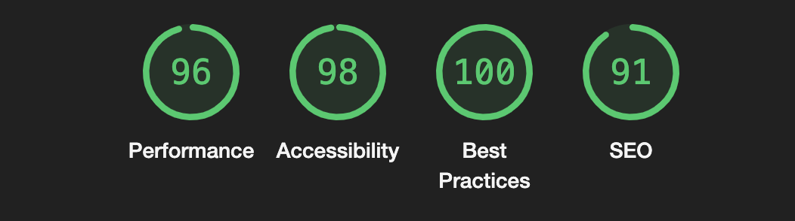

# POTR POTS — Responsive Product Landing Page

A modern, responsive landing page for the **POTR POTS** brand, focused on eco-friendly self-watering origami plant pots. The project presents product value, brand story, materials, team, and contact options in a mobile-first layout with interactive UI blocks.

**Live demo:** [potr-pots-seven.vercel.app](potr-pots-seven.vercel.app)

---

## Table of Contents

- [About](#about)
- [Features](#features)
- [Technologies](#technologies)
- [Getting Started](#getting-started)
  - [Prerequisites](#prerequisites)
  - [Install & Run](#install--run)
  - [Build](#build)
  - [Deploy](#deploy)
- [Project Structure](#project-structure)
- [Available Scripts](#available-scripts)
- [Accessibility & SEO](#accessibility--seo)
- [License](#license)

---

## About

This repository contains a single-page marketing website built with **HTML5, SCSS, and vanilla JavaScript**.  
It is bundled with **Parcel 2** and designed to be adaptive across mobile, tablet, and desktop breakpoints.

## Features

- Mobile-first responsive layout
- Semantic section-based page structure (header, feature blocks, contact area, footer)
- BEM-based SCSS architecture with reusable:
  - variables
  - mixins
  - functions
  - extends
- Interactive mobile menu (URL hash-driven open/close state)
- Materials section interactivity:
  - show more / show less content toggle
  - expandable advantage descriptions
  - slider-like horizontal switching via controls and pagination dots
- Contact form UI with submit handling and form reset
- Optimized static assets build through Parcel image optimization
- GitHub Pages-ready deployment workflow (`gh-pages`)



## Technologies

- HTML5
- SCSS (Sass)
- JavaScript (ES6+)
- Parcel 2
- ESLint
- Stylelint (+ BEM selector pattern plugin)
- Markuplint
- Prettier
- Husky
- lint-staged
- gh-pages

## Getting Started

### Prerequisites

- Node.js (recommended: 16+)
- npm

### Install & Run

1. Install dependencies:

   ```bash
   npm install
   ```

2. Start development server:

   ```bash
   npm start
   ```

Parcel serves `src/index.html` and rebuilds on file changes.

### Build

Create a production bundle:

```bash
npm run build
```

Output is generated in `dist/`.

### Deploy

Publish the built app to GitHub Pages:

```bash
npm run deploy
```

## Project Structure

```text
.
├─ src/
│  ├─ index.html
│  ├─ scripts/
│  │  └─ main.js
│  ├─ styles/
│  │  ├─ main.scss
│  │  ├─ reset.scss
│  │  ├─ blocks/
│  │  └─ utils/
│  └─ images/
│     ├─ icons/
│     └─ photos/
├─ .github/workflows/
├─ .husky/
├─ dist/
├─ package.json
└─ README.md
```

## Available Scripts

- `npm start` — run Parcel dev server
- `npm run build` — create production build
- `npm run lint` — run ESLint + Stylelint checks
- `npm run deploy` — deploy `dist/` to GitHub Pages

> Note: the current `lint` script in `package.json` points to `src/js` and `src/style`; if you keep the present folder names (`src/scripts`, `src/styles`), update the paths in that script.

## Accessibility & SEO

The page uses semantic HTML, `meta` description/keywords, and `aria-label`s for interactive controls and social links.  
It also includes descriptive image `alt` attributes and responsive-friendly markup.

## License

Licensed under the **ISC License**. See [LICENSE](./LICENSE).
